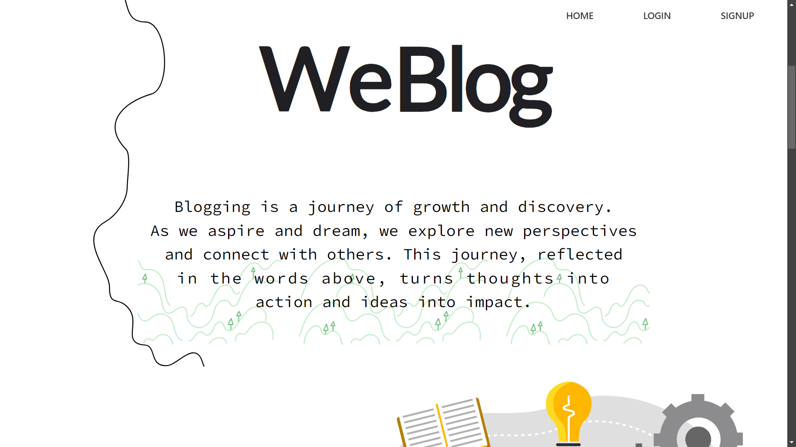
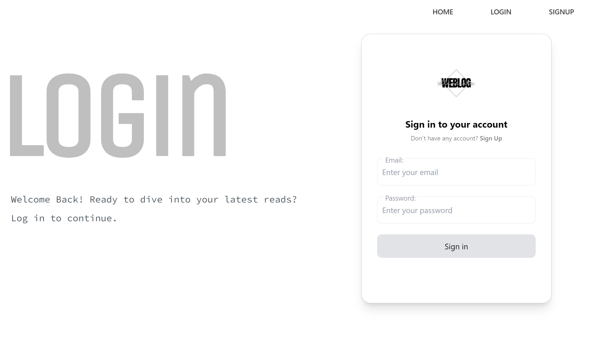
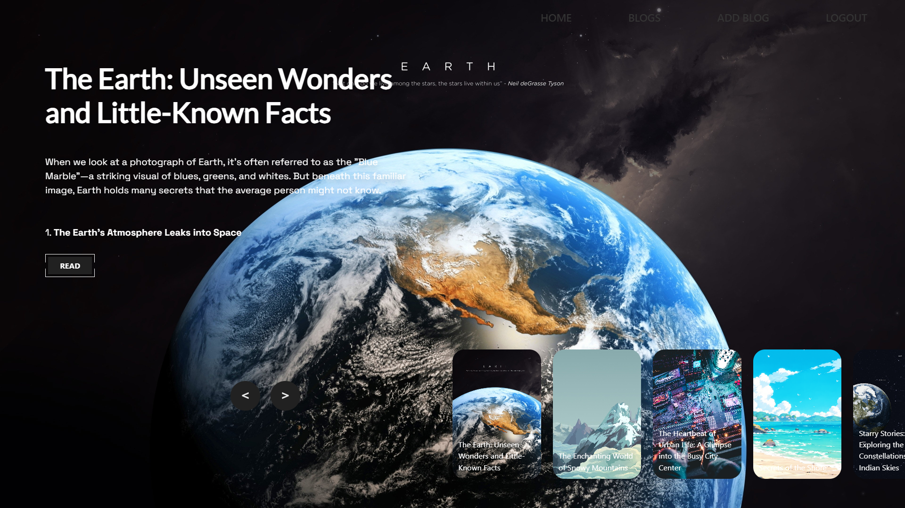
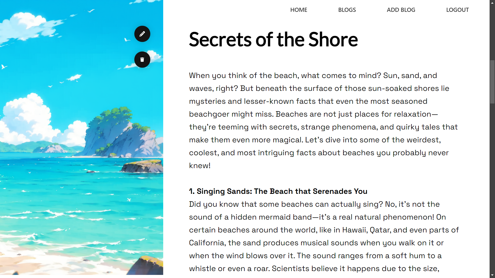
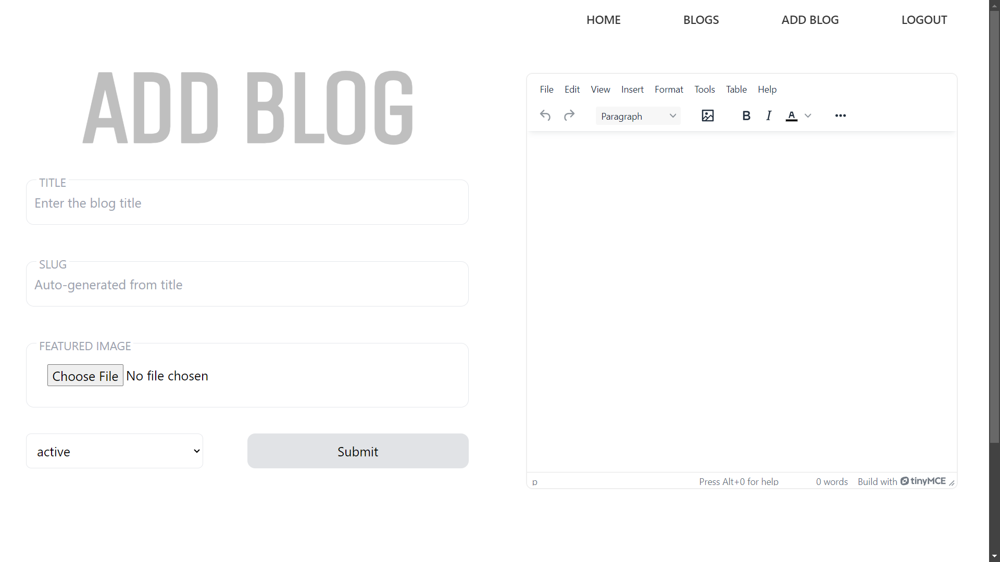
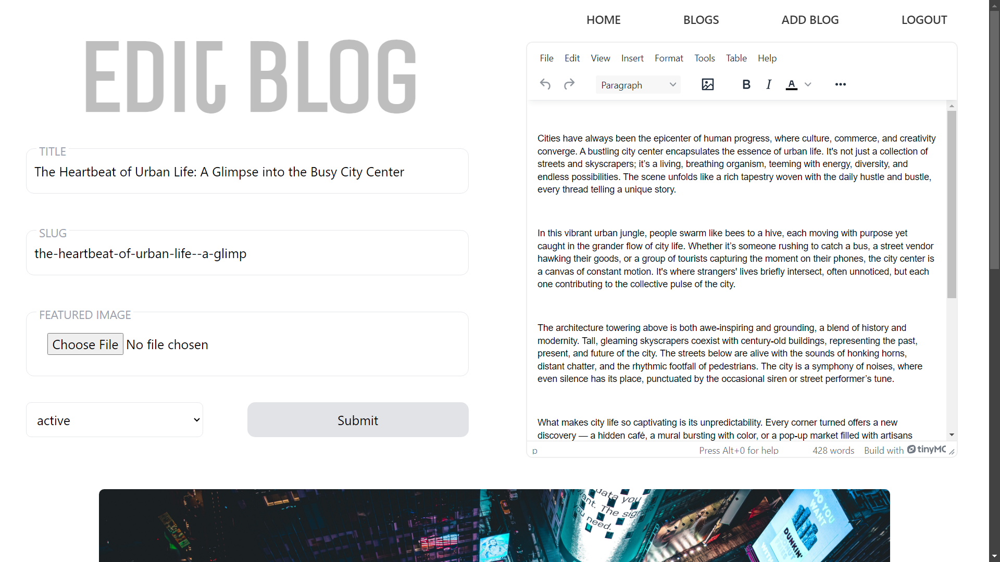

# WeBlog

**WeBlog** is a modern, responsive blog website designed for discovering and sharing new ideas and topics. Users can browse through a variety of blog posts written by others, or contribute by writing their own blogs once they sign up or log in. The website offers a smooth reading experience across all devices.
   

## Table of Contents

- [Features](#features)
- [Technologies Used](#technologies-used)
- [Live Website](#live-website)
- [Login Credentials](#login-credentials)
- [Acknowledgements](#acknowledgements)
- [License](#license)
   

## Features

- **User Authentication**: Users can **sign up** or **log in** to create a personalized experience.
- **Read and Write Blogs**:
  - Browse and read blog posts by other users.
  - Once logged in, users can **write**, **edit**, and **publish** their own blog posts.
- **Responsive Design**: Fully optimized for desktop, tablet, and mobile devices.
- **Dynamic Content**: Blog posts are dynamically fetched and displayed.
- **Fast Performance**: Hosted on Vercel for fast load times and optimized asset delivery.
   

## Technologies Used

### Frontend:
- **React**: A JavaScript library for building user interfaces.
- **Tailwind CSS**: A utility-first CSS framework for responsive styling.
- **Vite**: A fast frontend build tool.
- **Framer Motion**: For creating smooth animations.
- **React Router DOM**: For navigation and routing between pages.
- **React Redux & Redux Toolkit**: State management solution for React apps.
- **React Hook Form**: For easy form management and validation.
- **TinyMCE**: A WYSIWYG editor integrated using `@tinymce/tinymce-react`.
- **HTML React Parser**: To parse and render HTML strings as React components.

### Backend & Services:
- **Appwrite**: A backend-as-a-service platform used for handling user authentication, database, and storage.
   

## Live Website

You can explore the live version of the website here: [WeBlog](https://weblogspace.vercel.app)
  

## Login Credentials

Use the following credentials to log in and explore the full functionality of the website:

- **Email**: sampleuser@example.com
- **Password**: password123
   

## Screenshots

### Homepage

### Login Page

### Blogs Overview

### Read Blog

### Add New Blog

### Edit Blog

   

## Acknowledgements

The basic logic and structure of this project were inspired by the online course taught by **Hitesh Choudhary**.
   

## License

This project is for demonstration purposes only. The code is shared for learning and reference but not intended for redistribution or use in commercial projects without permission.
